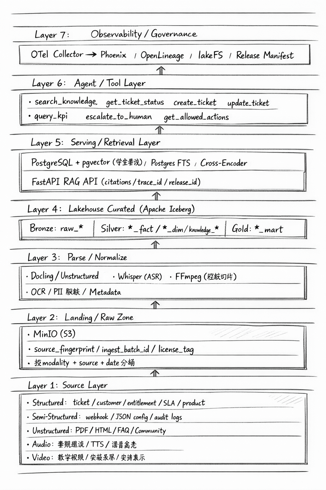
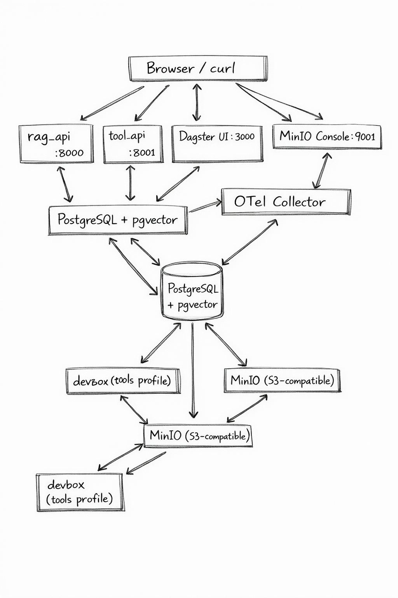
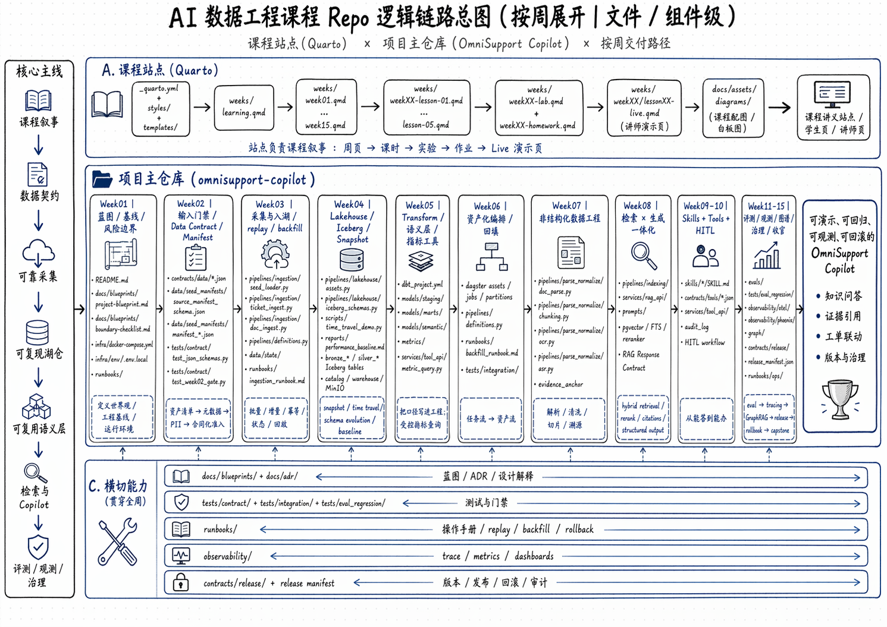

# OmniSupport Copilot

多模态企业支持知识层 + 工单联动 AI 系统（准生产级课程项目）

---

## 一句话定义

面向虚构企业 **Northstar Systems** 的准生产级多模态 AI 支持系统：
支持文档问答、证据引用、工单查询/创建/更新、指标查询、人工介入（HITL）、审计追踪、回归评测、版本与回滚。

---

## 前置条件

Week01 默认走 **Docker-only** 路线。学员不需要先配置本地 Python、PostgreSQL 或 MinIO。

必需：
- Docker Desktop / Docker Engine 24+
- Docker Compose V2（`docker compose` 可用）
- 现代浏览器（访问 Dagster / MinIO / Phoenix）

可选：
- `ANTHROPIC_API_KEY`
  - 留空：可完成 Week01 工程基线验证，RAG API 返回 fallback 响应
  - 填写：可继续验证真实生成链路

支持环境：
- macOS Apple Silicon / Intel
- Linux x86_64 / arm64
- Windows 11 + Docker Desktop / WSL2

---

## 机器配置建议

| 场景 | CPU | 内存 | 磁盘空闲 | 说明 |
|------|-----|------|---------|------|
| Student Core Pack 最低配置 | 4 核 | 16 GB | 25 GB | 可完成 Week01-Week03 本地练习，首次构建会偏慢 |
| Student Core Pack 推荐配置 | 8 核 | 24 GB | 50 GB | 本地开发、反复重建、跑 contract test 更稳 |
| Instructor Scale Pack 推荐配置 | 8-12 核 | 32 GB+ | 80 GB+ | 适合更大数据包、更多 chunk、演示规模差异 |

说明：
- Student Core Pack 的目标规模是 `1,200–1,800` 源资产、`6–12 万` chunk，面向单机 Docker Compose。
- Instructor Scale Pack 的目标规模是 `6,000–10,000` 源资产、`20–50 万` chunk，更适合共享实验环境或高配机器。

---

## 快速启动（Week01 基线）

默认情况下，数据库只在 Docker 网络内可见，不要求也不依赖学员本机安装 PostgreSQL。

```bash
# 1. 复制环境变量
cp infra/env/.env.example infra/env/.env.local
# Week01 可先留空 ANTHROPIC_API_KEY
# 留空时，RAG API 会走 fallback 响应，不影响工程基线验证

# 2. 启动所有服务
docker compose --env-file infra/env/.env.local -f infra/docker-compose.yml up -d --build

# 3. 验证健康
curl http://localhost:8000/health   # RAG API
curl http://localhost:8001/health   # Tool API
# 在浏览器访问:
# http://localhost:3000  Dagster UI
# http://localhost:9001  MinIO Console
# http://localhost:6006  Phoenix (AI 可观测)

# 4. 生成种子工单数据（无本地依赖）
docker compose --profile tools --env-file infra/env/.env.local -f infra/docker-compose.yml run --rm devbox \
  python data/synthetic_generators/ticket_simulator.py --count 500 \
    --output data/canonization/tickets/tickets-seed-001.jsonl

# 5. dry-run seed loader（无本地依赖）
docker compose --profile tools --env-file infra/env/.env.local -f infra/docker-compose.yml run --rm devbox \
  python -m pipelines.ingestion.seed_loader \
    --manifest-path data/seed_manifests/manifest_edge_gateway_pdf_v1.json \
    --manifest-path data/seed_manifests/manifest_tickets_synthetic_v1.json \
    --manifest-path data/seed_manifests/manifest_workspace_helpcenter_v1.json

# 6. 运行契约测试（无本地依赖）
docker compose --profile tools --env-file infra/env/.env.local -f infra/docker-compose.yml run --rm devbox \
  pytest tests/contract/ -v
```

如果你仍然想在宿主机本地直接跑 Python 命令，再自行创建 `.venv`。默认文档路径不再要求学员这么做。

---

## 业务世界观

| 产品线 | 定位 | 典型数据 |
|--------|------|---------|
| **Northstar Workspace** | 企业协作 / 工单 / 自动化 SaaS | Help Center, FAQ, Release Notes, API 文档, 工单 |
| **Northstar Edge Gateway** | 边缘采集设备 / 网关硬件 | PDF 安装手册, 规格说明, 接线图, 故障排查视频 |
| **Northstar Studio** | 实施与监控产品 | 教学视频, 录屏教程, 错误码手册, 社区问答 |

---

## 架构总览（七层）



详见 [docs/blueprints/project-blueprint.md](docs/blueprints/project-blueprint.md)

---

## 技术栈与选型理由

| 层 | 技术 | 为什么这样选 |
|----|------|-------------|
| 对象存储 | MinIO | 本地可跑，接口与 S3 兼容，后续切云端对象存储时迁移成本低 |
| 结构化 + 向量检索 | PostgreSQL + pgvector | Week01-Week08 阶段单机可跑，既能保留结构化数据，也能承接向量检索与 FTS |
| 湖仓层 | Apache Iceberg | 支持快照、时间旅行、Schema Evolution，契合课程后续治理与回滚章节 |
| 编排层 | Dagster | 资产化编排更适合课程讲“依赖、回填、血缘、DoD” |
| 服务层 | FastAPI | 契约清晰、调试成本低、适合本地教学和 API smoke test |
| 可观测 | OpenTelemetry + Phoenix | 从 Week01 就预埋 `trace_id / release_id`，后续能自然衔接 tracing 与 bad case replay |
| 契约层 | JSON Schema | 数据契约、工具契约、发布契约都能机读校验，适合课程工程化落地 |
| 本地工具执行 | Docker `devbox` | 学员不必先配本地 Python 环境，命令路径统一 |

选型原则：
- 先保证 **Student Core Pack 本地可跑**
- 再保证后续章节能自然扩展到治理、评测、Tracing、回滚
- 不为“演示规模”单独写另一套代码路径

---

## 本地部署拓扑



默认对宿主机开放的端口：
- `8000` — RAG API
- `8001` — Tool API
- `3000` — Dagster
- `9000/9001` — MinIO API / Console
- `6006` — Phoenix

默认不对宿主机开放：
- PostgreSQL `5432`
  - 只在 Docker 网络内可见，避免与学员本机数据库冲突

---

## 课程交付与 Repo 逻辑图



这张图不是单纯的目录树，而是把三层关系放在一起看：
- 课程站点（Quarto）如何展开到周页、课时页、实验页、Live 演示页
- `omnisupport-copilot` 主仓库如何按周推进到数据契约、采集、湖仓、解析、检索、工具、评测与治理
- 横切能力如何在 `docs/`、`tests/`、`runbooks/`、`observability/`、`contracts/release/` 之间复用

阅读建议：
- 想先理解系统能力边界：看上面的“七层架构总览”
- 想理解本地怎么跑起来：看上面的“本地部署拓扑”
- 想理解课程与主仓库如何逐周对齐：看这张“Repo 逻辑图”
- 想直接定位文件夹：继续看下面的“仓库结构”

---

## 仓库结构

```
omnisupport-copilot/
├── infra/                      # Docker Compose + 数据库 migrations + 环境变量
├── services/
│   ├── rag_api/                # FastAPI RAG 检索生成服务 (port 8000)
│   └── tool_api/               # FastAPI 工单工具 + HITL + 审计 (port 8001)
├── pipelines/                  # Dagster 资产化 pipeline
│   ├── ingestion/              # Seed loader + 采集资产
│   ├── parse_normalize/        # 文档解析 + 切片 + 证据链
│   ├── lakehouse/              # Iceberg Bronze/Silver/Gold 表
│   └── indexing/               # 向量索引构建
├── contracts/                  # JSON Schema 数据/工具/发布契约
│   ├── data/                   # 四类数据契约 (doc/ticket/audio/video)
│   ├── tools/                  # 工具契约规范 + 具体工具定义
│   └── release/                # Release Manifest Schema
├── data/
│   ├── seed_manifests/         # 种子数据清单
│   ├── synthetic_generators/   # 合成工单/音频生成器
│   └── canonization/           # 规范化后的课程资产
├── observability/              # OTel Collector 配置 + Phoenix + dashboards
├── evals/                      # 评测集 + eval harness + 回归报告
├── tests/
│   ├── contract/               # JSON Schema 契约测试
│   ├── integration/            # API smoke tests
│   └── eval_regression/        # 回归评测测试
├── docs/blueprints/            # 项目蓝图 + 风险边界清单
└── runbooks/                   # 运维操作手册
```

---

## 逐周进度

| Week | 状态 | 主要产出 |
|------|------|---------|
| W01 | ✅ | 工程基线、契约、seed manifest、蓝图 |
| W02-03 | 🔄 | 四类数据契约、ingest pipeline |
| W04 | 📅 | Iceberg Bronze/Silver、time travel |
| W05-08 | 📅 | KPI mart、多模态解析、混合检索、RAG API |
| W09-15 | 📅 | Tool层、评测、Tracing、GraphRAG、治理、Capstone |

---

## 核心实施原则

1. **Data-first** — 先数据层，再生成层
2. **Workflow-first** — 先稳定工作流，再复杂 Agent
3. **Evidence-first** — 所有回答必须带 `evidence_anchor` / `citation`
4. **Release-aware** — 所有服务预埋 `release_id`, `trace_id`
5. **Dual-scale** — Student Core Pack（本地可跑）+ Instructor Scale Pack（规模演示）

---

## 非功能性要求

- **可重复**：同 release 组合离线评测可复现
- **可观测**：所有请求携带 `trace_id`，关键 span 可查
- **可回滚**：30 分钟内可回滚到上一稳定 release
- **可审计**：高风险操作记录完整审计日志
