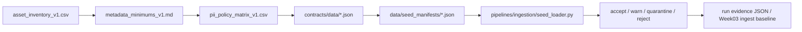

# Week02 Ingest Strategy v1

> 适用范围：Week02 课时 5、实验页、作业页
> 目标：把 `inventory -> contract -> manifest -> gate -> run evidence` 这条链压成 Week03 ingest baseline

## 1. 当前 repo 的 Week02 运行闭环



## 2. Manifest Inventory

| Manifest | Purpose | Contract | Load mode | Teaching use |
|---------|---------|----------|-----------|--------------|
| `manifest_tickets_synthetic_v1.json` | 结构化工单基线 | `omni://contracts/data/ticket/v1` | `full_snapshot` | 课时1、课时4、Week03 ticket ingest 起点 |
| `manifest_workspace_helpcenter_v1.json` | HTML/FAQ/Release Notes 文档源 | `omni://contracts/data/doc_asset/v1` | `full_snapshot` | 课时2、课时3、课时5 的 document 路线 |
| `manifest_edge_gateway_pdf_v1.json` | PDF 手册与排障文档 | `omni://contracts/data/doc_asset/v1` | `full_snapshot` | 讲 citation / evidence / parse handoff |
| `manifest_week02_practice_v1.json` | Week02 增量练习清单 | `omni://contracts/data/ticket/v1` | `incremental_cursor` | 演示 accept / warn / quarantine 三态 gate |

## 3. Gate Policy Semantics

| Judgment | Meaning | Week02 handling | Week03 implication |
|----------|---------|-----------------|--------------------|
| `accept` | 元数据、PII、contract 绑定都满足最低线 | 可继续进入 ingest | 正常写 raw zone + metadata store |
| `warn` | 可先放行，但存在可补齐缺口 | 允许进入 dry-run / baseline | 需要在 run evidence 里留下补齐任务 |
| `quarantine` | 数据尚可保留，但不应直接进入主链 | 保留 source，停止下游消费 | 等待 redaction / metadata repair / owner review |
| `reject` | 契约或运行时意图错误，不能进入系统 | 直接失败 | 必须先改 manifest / contract / source |

## 4. Load Modes

| Load mode | What it means | Minimum fields |
|-----------|---------------|----------------|
| `full_snapshot` | 覆盖当前完整世界 | 无强制窗口字段 |
| `incremental_cursor` | 基于 cursor 读取增量变化 | `selection_window.cursor_field`, `selection_window.cursor_start` |
| `cdc` | 变更日志 / 事件流 | `selection_window.cursor_field` 或 `selection_window.watermark_field` |
| `replay` | 重放历史批次 | `selection_window.replay_from_batch` |
| `backfill` | 回补历史窗口 | `selection_window.start_at`, `selection_window.end_at` |

## 5. Exact Demo Commands

默认都在 repo 根目录执行。

### 5.1 Contract tests

```bash
docker compose --profile tools --env-file infra/env/.env.local -f infra/docker-compose.yml run --rm devbox \
  pytest tests/contract/ -v
```

### 5.2 Seed loader dry-run with run evidence export

```bash
docker compose --profile tools --env-file infra/env/.env.local -f infra/docker-compose.yml run --rm devbox \
  python -m pipelines.ingestion.seed_loader \
    --manifest-dir data/seed_manifests \
    --report-json docs/blueprints/week02/run_reports/week02-dry-run-report.json
```

## 6. What to Point Out During Class

1. `contract_ref` 不是注释字段，它把 source 和可执行 contract 绑在一起。
2. `load_mode` 不是为了“分类”，而是为 Week03 的 state / watermark / replay 预留运行语义。
3. `gate_policy` 不是二元通过/失败，而是显式声明 `warn / quarantine / reject`。
4. `report-json` 不是锦上添花，它是最小 run evidence，后续才能做 replay、audit、release notes。

## 7. Compatibility Notes for Lesson 4

建议在讲课时直接拿下面三类变更举例：

| Change | Classification | Why |
|--------|----------------|-----|
| `ticket.tags` 新增可选字段 | additive | 只扩展信息，不破坏现有消费方 |
| `audio.asr_confidence` 从 optional 提升为质量门禁 | conditional | schema 可以兼容，但发布时要确认旧数据是否补齐 |
| `ticket.status` 删除 `pending` 或改语义 | breaking | shape 可能没大变，但业务含义会穿透 KPI / Tool 路由 |

## 8. Week03 Handoff

Week03 接的不是“几份文档”，而是这四样运行前置条件：

1. 哪些 source 已被标记为 `ready_now`。
2. 哪些 metadata / PII 规则已经被压成 contract。
3. 哪个 manifest 已声明本次 ingest 的窗口与 contract 绑定。
4. 最近一次 dry-run 的 run evidence 里，哪些 source 仍是 `warn` / `quarantine`。
