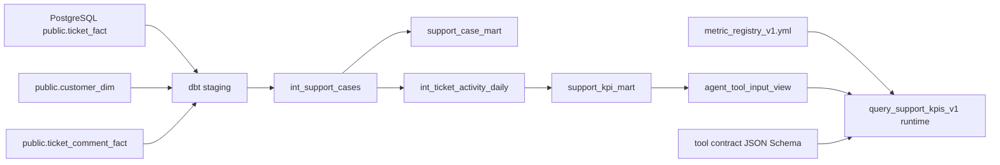

# Week05 Analytics Path v1

Week05 的主线是把 Week03/Week04 已进入 PostgreSQL 的结构化工单数据，转换成可被 Agent 安全查询的 KPI 语义层。它不是湖仓重写，也不是 NL2SQL，而是一个最小可运行的 Analytics Engineering 闭环。

## 设计边界

- 输入：`public.ticket_fact`、`public.customer_dim`、`public.ticket_comment_fact`、`public.knowledge_doc`。
- 转换：`analytics/` 下的 dbt Core 项目，目标 schema 为 `analytics`。
- 输出：`support_case_mart`、`support_kpi_mart`、`agent_tool_input_view`。
- Agent 入口：`query_support_kpis_v1` 工具契约和 Tool API 只读端点。
- 禁止项：Agent 不接收 raw SQL，不访问 PII 字段，不直查 `ticket_fact` 原表。

## 目录映射

| 课堂概念 | 项目文件 |
|---|---|
| dbt source | `analytics/models/sources.yml` |
| staging | `analytics/models/staging/*.sql` |
| intermediate | `analytics/models/intermediate/*.sql` |
| marts | `analytics/models/marts/*.sql` |
| metric registry | `analytics/metric_registry_v1.yml` |
| registry validator | `analytics/scripts/validate_metric_registry.py` |
| tool contract | `contracts/tools/tools/query_support_kpis_v1.json` |
| query runtime | `services/tool_api/app/kpi_query.py` |
| API route | `services/tool_api/app/routers/kpis.py` |

## 数据链路

## 控制点

- `support_case_mart` 不暴露 `contact_email`、评论正文、subject 等原始文本字段；`pii_level/pii_redacted` 仅作为治理标志保留。
- `support_kpi_mart` 是 metric-row 形态，方便工具通过 `metric_name` 白名单查询。
- `agent_tool_input_view` 是 Agent 查询边界，只包含安全维度和数值列。
- `metric_registry_v1.yml` 控制指标、维度、过滤器、角色和最大时间窗口。
- Tool API 使用参数化 SQL，仅允许访问 `analytics.agent_tool_input_view`。
