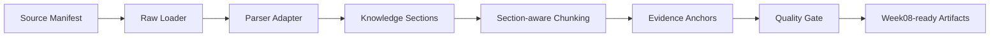

# Week07 Execution Blueprint

Week07 turns raw document declarations into retrieval-ready document assets.

## Main Chain

## File-Level Map

| Step | Files |
|---|---|
| Manifest input | `data/seed_manifests/manifest_workspace_helpcenter_v1.json` |
| Schema contracts | `contracts/data/knowledge_section.schema.json`, `document_chunk.schema.json`, `evidence_anchor.schema.json`, `parse_run.schema.json`, `chunk_quality_sample.schema.json` |
| Raw loading | `pipelines/parse_normalize/raw_loader.py` |
| Parser routing | `pipelines/parse_normalize/parser_adapter.py` |
| Chunking | `pipelines/parse_normalize/chunking.py` |
| Evidence anchors | `pipelines/parse_normalize/evidence_anchor.py` |
| Quality gate | `pipelines/parse_normalize/quality_gate.py` |
| CLI orchestration | `pipelines/parse_normalize/run_parse.py` |
| Dagster wrapper | `pipelines/parse_normalize/assets.py`, `pipelines/definitions.py` |
| Tests | `tests/contract/test_week07_parse_contracts.py`, `tests/integration/test_week07_parse_pipeline.py`, `tests/integration/test_week07_quality_gate.py` |

## Runtime Outputs

- `artifacts/week07/sections.json`
- `artifacts/week07/chunks.json`
- `artifacts/week07/evidence_anchors.json`
- `artifacts/week07/chunk_quality_samples.json`
- `reports/week07/parse_run_report.json`
- `reports/week07/chunk_quality_report.md`
- `reports/week07/week8_ready_gate.json`

## Teaching Point

Week07 is not "parse text and split by tokens." It is an input-control layer for retrieval. Every chunk must carry source identity, version, parser capability, and evidence anchors before Week08 can index it.
