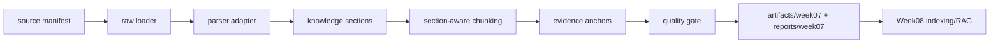

# Week07 Execution Plan

## Objective

Implement a minimal but durable Week07 parse/normalize layer:

1. Validate schemas and fixtures.
2. Parse document assets into normalized sections.
3. Chunk sections with a section-aware strategy.
4. Generate evidence anchors from parser provenance, not from LLM output.
5. Produce quality reports and a Week08-ready gate.
6. Expose a CLI path and a Dagster thin wrapper.

## Order Of Work

1. Add Week07 diagnosis, execution plan, and scope boundary docs.
2. Add JSON schemas and fixture contract tests.
3. Add additive migration for parse/normalize metadata.
4. Split parser/chunker/anchor/gate/reporting code into focused modules.
5. Add `pipelines.parse_normalize.run_parse` CLI.
6. Convert Dagster parse assets from stub to thin wrappers over the same core functions.
7. Add runbook and classroom-facing blueprint docs.
8. Validate with local Python tests first, then Docker/Podman devbox commands where available.

## Runtime Path

## Parser Strategy

- `docling`: preferred for PDF if installed.
- `unstructured`: preferred for HTML/API/release notes if installed.
- `fallback`: deterministic stdlib parser for local course demos and tests.
- `auto`: route by asset type and available dependency.

Fallback output must be explicitly marked with parser capability and warnings. It is valid for classroom dry-run validation, but Week08 must not assume it has Docling-level coordinates.

## Validation Plan

- Run all Week07 contract tests.
- Run Week07 parse pipeline tests.
- Load Dagster definitions.
- Run Week06 definitions loadable test to protect Week06.
- Run existing Week08 index/RAG contract tests to protect the downstream consumer.
- Run full `tests/contract/` if the devbox is available.

## Submission Policy

Commit durable source, schemas, docs, runbooks, tests, and intentional sample reports. Do not commit local runtime artifacts created by ad hoc lab runs unless they are stable sample reports required by the course package.
