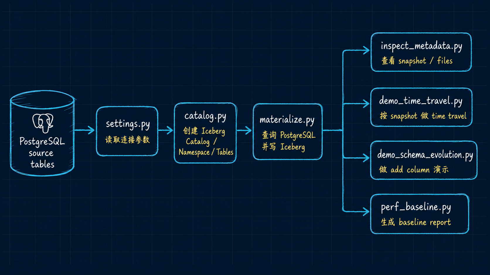

# Week04 Lakehouse Code

Primary path: Docker devbox.

## Code Relationship

This diagram is the quickest way to explain the Week04 code path to learners: source PostgreSQL tables are configured by `settings.py`, registered through `catalog.py`, materialized by `materialize.py`, and then inspected or demonstrated by the four classroom scripts.



Core reading order:
- `settings.py`
- `catalog.py`
- `materialize.py`
- `inspect_metadata.py`
- `demo_time_travel.py`
- `demo_schema_evolution.py`
- `perf_baseline.py`

## Smoke Commands

```bash
docker compose --profile tools --env-file infra/env/.env.local -f infra/docker-compose.yml run --rm devbox \
  python -m pipelines.lakehouse.settings --check
```

```bash
docker compose --profile tools --env-file infra/env/.env.local -f infra/docker-compose.yml run --rm devbox \
  python -m pipelines.lakehouse.catalog --smoke
```

```bash
docker compose --profile tools --env-file infra/env/.env.local -f infra/docker-compose.yml run --rm devbox \
  python -m pipelines.lakehouse.materialize --all-core
```

The four Week04 core tables are:
- `bronze.raw_ticket_event`
- `bronze.raw_doc_asset`
- `silver.ticket_fact`
- `silver.knowledge_doc`

Dagster remains a thin wrapper in Week04 because the compose service uses the upstream Dagster image. The devbox contains the PyIceberg runtime and is the source of truth for classroom execution.
