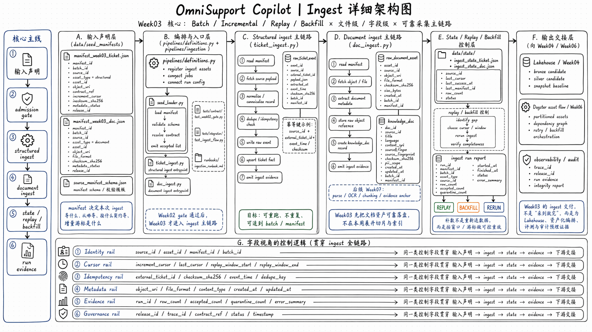

# Runbook: Week03 Ingestion Baseline

> 适用范围：Week03 batch ingest / checkpoint / recovery 最小工程演示

## 目标

用最小命令演示：

1. admission gate
2. smoke report
3. checkpoint/state
4. replay/backfill plan and explicit execute

## Architecture Map



建议先理解这张图，再开始跑命令。理解顺序按图从左到右：
- 输入声明层：`data/seed_manifests/*.json` 和 `source_manifest_schema.json`
- 编排与入口层：`pipelines/definitions.py`、`seed_loader.py`、`ticket_ingest.py`、`doc_ingest.py`
- structured ingest 主链路：manifest -> payload -> normalize -> idempotency -> raw event / ticket fact
- document ingest 主链路：manifest -> object/file -> metadata -> raw asset / knowledge_doc -> ingest evidence
- state / replay / backfill：`data/state/`、checkpoint、`replay_backfill.py`、run report

总的来说：
- Week03 的重点不是把 Lakehouse 和检索完全做完，而是把 ingest 主链路、state、replay/backfill、run evidence 这些“可继续扩展的基础骨架”搭起来。

## 前置条件

- 已按 `runbooks/week01-startup.md` 启动基础服务
- Docker 可用
- `infra/env/.env.local` 已存在

## Step 1：contract baseline

```bash
docker compose --profile tools --env-file infra/env/.env.local -f infra/docker-compose.yml run --rm devbox \
  pytest tests/contract/ -v
```

## Step 2：seed loader smoke report

```bash
docker compose --profile tools --env-file infra/env/.env.local -f infra/docker-compose.yml run --rm devbox \
  python -m pipelines.ingestion.seed_loader \
    --manifest-path data/seed_manifests/manifest_edge_gateway_pdf_v1.json \
    --manifest-path data/seed_manifests/manifest_tickets_synthetic_v1.json \
    --manifest-path data/seed_manifests/manifest_workspace_helpcenter_v1.json \
    --report-json reports/week03/seed_loader_smoke_report.json
```

## Step 3：ticket ingest smoke report

```bash
docker compose --profile tools --env-file infra/env/.env.local -f infra/docker-compose.yml run --rm devbox \
  python -m pipelines.ingestion.ticket_ingest \
    --input tests/integration/fixtures/week03/tickets-smoke.jsonl \
    --batch-id batch-week03-ticket-smoke \
    --dry-run \
    --report-json reports/week03/ticket_ingest_smoke_report.json
```

真实写入时，`ticket_ingest` 会做两件事：

- PostgreSQL `raw_ticket_event` 按 `source_id + source_fingerprint` 做幂等保护，同一份 JSONL 重跑不会让 Bronze 翻倍。
- 成功且无 invalid/error 时写入 checkpoint，供 `replay_backfill --state-path` 读取。

示例：

```bash
docker compose --profile tools --env-file infra/env/.env.local -f infra/docker-compose.yml run --rm devbox \
  python -m pipelines.ingestion.ticket_ingest \
    --input tests/integration/fixtures/week03/tickets-smoke.jsonl \
    --batch-id batch-week03-ticket-smoke \
    --report-json reports/week03/ticket_ingest_smoke_report.json
```

## Step 4：doc ingest smoke report

```bash
docker compose --profile tools --env-file infra/env/.env.local -f infra/docker-compose.yml run --rm devbox \
  python -m pipelines.ingestion.doc_ingest \
    --manifest data/seed_manifests/manifest_workspace_helpcenter_v1.json \
    --batch-id batch-week03-doc-smoke \
    --dry-run \
    --report-json reports/week03/doc_ingest_smoke_report.json
```

## Step 5：checkpoint/state

文件：

- `data/canonization/checkpoints/week03_ingest_state.json`

要检查的字段：

- `source_id`
- `last_processed_cursor`
- `last_success_batch_id`
- `last_run_id`
- `updated_at`

## Step 6：replay/backfill plan

```bash
docker compose --profile tools --env-file infra/env/.env.local -f infra/docker-compose.yml run --rm devbox \
  python -m pipelines.ingestion.replay_backfill \
    --mode replay \
    --source-id structured:tickets:seed_batch_001 \
    --dry-run \
    --report-json reports/week03/recovery_decision_log.json
```

默认只输出计划，不改数据库。需要真正执行补数时，必须显式加 `--execute --input`：

```bash
docker compose --profile tools --env-file infra/env/.env.local -f infra/docker-compose.yml run --rm devbox \
  python -m pipelines.ingestion.replay_backfill \
    --mode backfill \
    --source-id structured:tickets:seed_batch_001 \
    --batch-id batch-week03-backfill-001 \
    --start-cursor 2026-04-17T00:00:00Z \
    --end-cursor 2026-04-17T23:59:59Z \
    --input data/canonization/tickets/tickets-seed-001.jsonl \
    --execute \
    --report-json reports/week03/recovery_execute_log.json
```

执行路径仍然复用 `ticket_ingest`，所以会继承 raw Bronze 幂等和 checkpoint 更新。

## Step 7：Week03 integration tests

```bash
docker compose --profile tools --env-file infra/env/.env.local -f infra/docker-compose.yml run --rm devbox \
  pytest tests/integration/ -v
```

## 预期结果

- `reports/week03/` 下出现 4 个 JSON 报告
- `tests/integration/` 新增 Week03 测试通过
- Week01 / Week02 现有命令不需要改写
