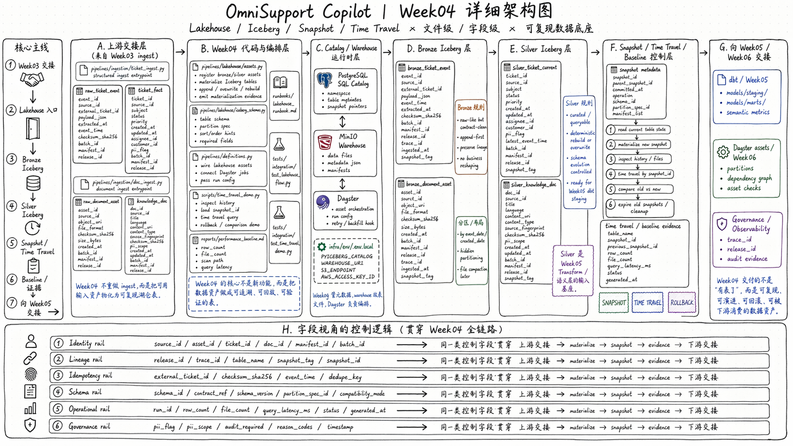

# Runbook: Week04 Lakehouse Baseline

> 适用范围：Week04 Iceberg / Snapshot / Time Travel 最小工程讲解

## 目标

用 Week03 已经接好的 ingest 结果，解释 Week04 为什么要把数据推进到可复现、可回滚、可追溯的 Lakehouse 层。

## Architecture Map



建议先理解这张图，再进入代码文件。理解顺序按图从左到右：
- 上游交接层：Week03 的 `ticket_ingest.py` / `doc_ingest.py` 如何把结构化和文档资产交给 Week04
- Week04 代码与编排层：`pipelines/lakehouse/assets.py`、`pipelines/lakehouse/iceberg_schemas.py`、`pipelines/definitions.py`
- Catalog / Warehouse 运行时层：PostgreSQL SQL Catalog、MinIO Warehouse、Dagster orchestration
- Bronze Iceberg 层：保真落盘，不做过早业务解释
- Silver Iceberg 层：形成 `ticket_current`、`knowledge_doc` 这类可查询、可演化的规范化表
- Snapshot / Time Travel / Baseline：让“本次数据长什么样”变成可验证、可比较、可回滚的状态

总的来说：
- Week04 交付的不是“多几张表”，而是让 Week03 的 ingest 结果进入可复现、可回滚、可作为下游基座的数据底座。

## Files to Open

- `pipelines/ingestion/ticket_ingest.py`
- `pipelines/ingestion/doc_ingest.py`
- `pipelines/lakehouse/assets.py`
- `pipelines/lakehouse/iceberg_schemas.py`
- `pipelines/definitions.py`
- `docs/blueprints/project-blueprint.md`

## Demo Steps

1. 先从 `ticket_ingest.py` 和 `doc_ingest.py` 出发，强调 Week03 交付的是 ingest 入口，不是最终 Lakehouse。
2. 打开 `pipelines/lakehouse/assets.py`，说明 Bronze / Silver / Gold 资产在 Dagster 里的注册关系。
3. 打开 `pipelines/lakehouse/iceberg_schemas.py`，解释 Bronze 和 Silver 在 schema 设计上的差异：
   - Bronze：保真、append-first、少做业务解释
   - Silver：curated、可查询、可演化、为 Week05 语义层做准备
4. 打开 `pipelines/definitions.py`，说明 ingest、parse、lakehouse 三层资产如何被统一注册。
5. 再回到架构图，讲 `snapshot / time travel / rollback` 为什么不是运维附属功能，而是数据工程主链路的一部分。

## What to Emphasize

- Week03 解决的是“怎么可靠接进来”，Week04 解决的是“接进来之后怎么形成可信数据底座”。
- Iceberg 的价值不只是表格式存储，而是 `snapshot`、`time travel`、`schema evolution` 和可追溯版本。
- Bronze 和 Silver 不是重复造表，而是刻意把“原始保真”和“服务消费”拆开。
- Week05 的 `dbt / models / semantic metrics` 会直接建立在 Week04 的 Silver 基座之上。

## 当前仓库状态

- `pipelines/lakehouse/assets.py` 仍保留 Dagster 资产视角，但 Week04 主执行路径是 devbox CLI
- `pipelines/lakehouse/settings.py` 统一读取 Lakehouse 环境变量
- `pipelines/lakehouse/catalog.py` 负责 PyIceberg SQL Catalog、MinIO bucket、namespace 与四张核心表
- `pipelines/lakehouse/materialize.py` 负责把 PostgreSQL 的 Week03 ingest 结果物化到 Iceberg
- `pipelines/lakehouse/inspect_metadata.py`、`demo_time_travel.py`、`demo_schema_evolution.py`、`perf_baseline.py` 提供课堂可执行 demo
- 逐步执行手册见 `runbooks/week04/README.md`

## Week04 可执行入口

```bash
docker compose --profile tools --env-file infra/env/.env.local -f infra/docker-compose.yml run --rm devbox \
  python -m pipelines.lakehouse.catalog --smoke
```

```bash
docker compose --profile tools --env-file infra/env/.env.local -f infra/docker-compose.yml run --rm devbox \
  python -m pipelines.lakehouse.materialize --all-core --report-json reports/week04/materialization_report.json
```

```bash
docker compose --profile tools --env-file infra/env/.env.local -f infra/docker-compose.yml run --rm devbox \
  python -m pipelines.lakehouse.inspect_metadata --table silver.ticket_fact --view snapshots
```

## Week04 不做什么

- 不引入 Spark / Hive / Nessie / Trino / REST catalog
- 不把 Dagster 上游镜像当作 PyIceberg runtime
- 不实现 Gold mart / dbt / semantic layer
- 不迁移 RAG serving/indexing 到 Iceberg
