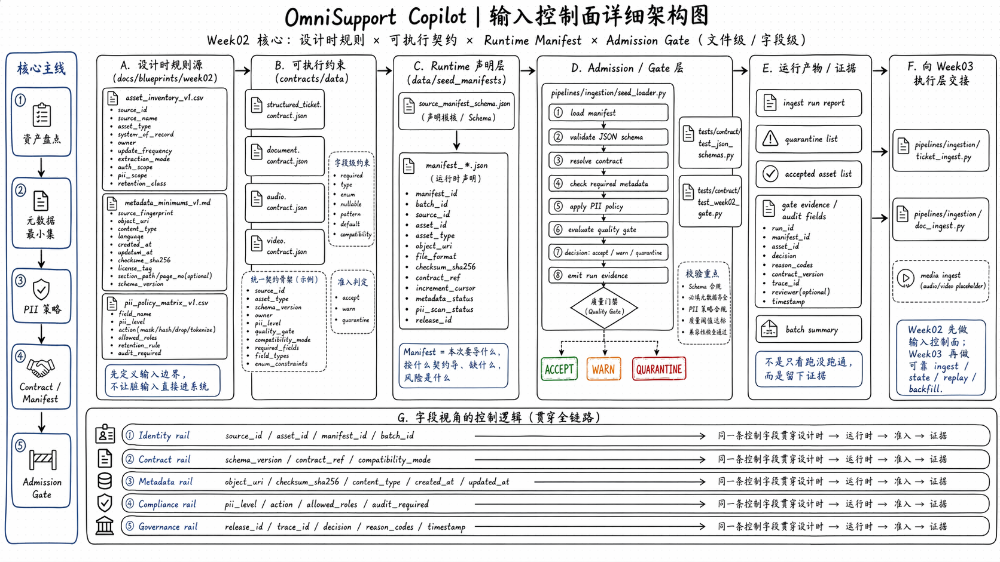

# Week02 Lesson 5 Runbook

## Goal

让 contract 真正开始驱动 ingest admission，并生成最小 run evidence。

## Architecture Map



建议把这张图放在课时开头先讲 3-5 分钟，再进入具体文件。讲解顺序按图从左到右：
- 设计时规则源：`asset_inventory / metadata_minimums / pii_policy_matrix`
- 可执行约束：`contracts/data/*.json`
- Runtime 声明层：`source_manifest_schema.json` 和 `manifest_*.json`
- Admission / Gate：`pipelines/ingestion/seed_loader.py`
- 运行产物 / 证据：`report / quarantine / accepted list / gate evidence`
- 向 Week03 交接：`ticket_ingest.py / doc_ingest.py`

课堂上可以先用这张图回答一句话：
- Week02 不是在“真正 ingest 很多数据”，而是在把“什么能进、为什么能进、没进怎么办”这套输入控制面搭起来。

## Files to Open

- `data/seed_manifests/source_manifest_schema.json`
- `data/seed_manifests/manifest_week02_practice_v1.json`
- `pipelines/ingestion/seed_loader.py`
- `docs/blueprints/week02/ingest_strategy_v1.md`

## Demo Steps

1. 在 manifest schema 里解释 `contract_ref / load_mode / selection_window / gate_policy` 的语义。
2. 打开 practice manifest，指出三条 asset 分别为什么会变成 `accept / warn / quarantine`。
3. 打开 `seed_loader.py`，只讲三件事：
   - manifest validator
   - gate judgment ranking
   - report JSON
4. 执行：

```bash
docker compose --profile tools --env-file infra/env/.env.local -f infra/docker-compose.yml run --rm devbox \
  python -m pipelines.ingestion.seed_loader \
    --manifest-dir data/seed_manifests \
    --report-json docs/blueprints/week02/run_reports/week02-dry-run-report.json
```

## What to Emphasize

- contract 回答“什么数据算合格”。
- manifest 回答“这次到底接哪一批”。
- gate 回答“现在能不能放行”。
- report JSON 回答“以后怎么追这次决定”。
