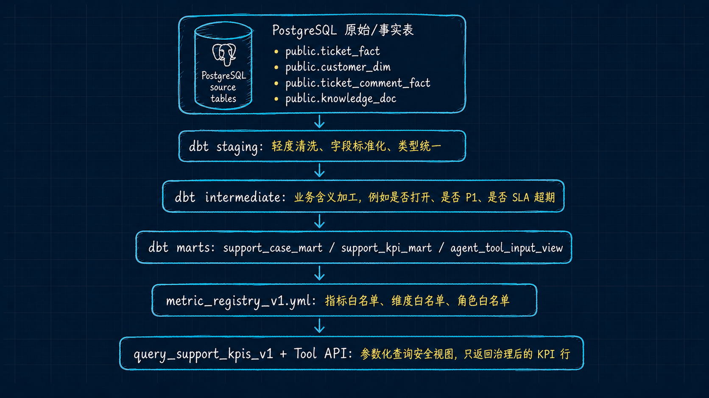

# Week05 Runbook — dbt KPI Mart + Governed KPI Tool

本 runbook 面向课堂实操。目标是本地跑通一条完整链路：PostgreSQL source -> dbt staging/intermediate/marts -> metric registry -> `query_support_kpis_v1` 工具调用。

## 0. 前置边界

- 本周不改 Week01-Week04 的主路径。
- 本周不要求宿主机安装 PostgreSQL、Python 或 dbt，默认走 Docker `devbox`。
- 本周不引入 dbt Cloud、MetricFlow、Snowflake、BigQuery、Spark 或 Trino。
- 本周不做 NL2SQL，Agent 只能通过白名单工具查询指标。

## Code Structure Map

录播前建议先用这张图解释 Week05 的代码结构：PostgreSQL 原始/事实表先进入 dbt staging，再进入 intermediate 业务加工层，最后形成 marts、安全视图、metric registry 和 Tool API 查询入口。



讲解顺序：
- `analytics/models/sources.yml` 定义 PostgreSQL source 表。
- `analytics/models/staging/` 做轻度清洗、字段标准化和类型统一。
- `analytics/models/intermediate/` 做业务含义加工，例如是否打开、是否 P1、是否 SLA 超期。
- `analytics/models/marts/` 产出 `support_case_mart`、`support_kpi_mart` 和 `agent_tool_input_view`。
- `analytics/metric_registry_v1.yml` 定义指标、维度和角色白名单。
- `services/tool_api/app/kpi_query.py` 通过参数化查询安全视图，只返回治理后的 KPI 行。

## 1. 启动依赖

```bash
cp infra/env/.env.example infra/env/.env.local

docker compose --env-file infra/env/.env.local -f infra/docker-compose.yml up -d --build postgres minio minio_init
```

如果本地已有 Week03/Week04 数据，可直接进入 dbt。否则先准备工单数据：

```bash
docker compose --profile tools --env-file infra/env/.env.local -f infra/docker-compose.yml run --rm devbox \
  python data/synthetic_generators/ticket_simulator.py --count 500 \
    --output data/canonization/tickets/tickets-seed-week05.jsonl

docker compose --profile tools --env-file infra/env/.env.local -f infra/docker-compose.yml run --rm devbox \
  python -m pipelines.ingestion.ticket_ingest \
    --input data/canonization/tickets/tickets-seed-week05.jsonl \
    --batch-id week05-demo
```

## 2. dbt debug

```bash
docker compose --profile tools --env-file infra/env/.env.local -f infra/docker-compose.yml run --rm devbox \
  bash -lc 'cd analytics && DBT_PROFILES_DIR=. dbt debug'
```

课堂讲解点：
- `analytics/profiles.yml` 通过环境变量连接 Docker 网络内的 `postgres`。
- `analytics/models/sources.yml` 明确 dbt source，不让下游模型猜原表。

## 3. dbt build

```bash
docker compose --profile tools --env-file infra/env/.env.local -f infra/docker-compose.yml run --rm devbox \
  bash -lc 'cd analytics && DBT_PROFILES_DIR=. dbt build --select tag:week05'
```

预期结果：
- `stg_*`、`int_*`、`support_case_mart`、`support_kpi_mart`、`agent_tool_input_view` 构建成功。
- dbt tests 全部通过。
- `no_pii_columns_in_agent_tool_input_view` 通过，说明工具视图没有暴露 PII/正文列。

## 4. 生成 dbt docs

```bash
docker compose --profile tools --env-file infra/env/.env.local -f infra/docker-compose.yml run --rm devbox \
  bash -lc 'cd analytics && DBT_PROFILES_DIR=. dbt docs generate'
```

课堂讲解点：
- `target/catalog.json` 和 `target/manifest.json` 是 dbt 可观测和血缘说明的基础。
- 这些 target 产物是本地生成物，不提交到 main。

## 5. 校验 Metric Registry

```bash
docker compose --profile tools --env-file infra/env/.env.local -f infra/docker-compose.yml run --rm devbox \
  python analytics/scripts/validate_metric_registry.py --json
```

预期结果：
- `valid: true`
- 指标数大于等于 5
- safe view 字段包含 `metric_date`、`metric_name`、`metric_value` 和允许维度。

## 6. 调用受控 KPI 工具

正向调用：

```bash
docker compose --profile tools --env-file infra/env/.env.local -f infra/docker-compose.yml run --rm devbox \
  bash -lc 'PYTHONPATH=services/tool_api python -m app.kpi_query --example valid'
```

负向调用，未知指标被拒绝：

```bash
docker compose --profile tools --env-file infra/env/.env.local -f infra/docker-compose.yml run --rm devbox \
  bash -lc 'PYTHONPATH=services/tool_api python -m app.kpi_query --example bad_metric || true'
```

负向调用，角色无权限被拒绝：

```bash
docker compose --profile tools --env-file infra/env/.env.local -f infra/docker-compose.yml run --rm devbox \
  bash -lc 'PYTHONPATH=services/tool_api python -m app.kpi_query --example bad_role || true'
```

课堂讲解点：
- 返回 `allowed=true` 才代表工具调用被允许。
- 返回 `allowed=false` 时要看 `denial_code`，例如 `METRIC_DENIED`、`ROLE_DENIED`。
- 工具运行时只查 `analytics.agent_tool_input_view`，不查原始表，不接收 raw SQL。

## 7. Tool API 端点验证

```bash
docker compose --env-file infra/env/.env.local -f infra/docker-compose.yml up -d --build tool_api

curl -s http://localhost:8001/health

curl -s -X POST http://localhost:8001/api/v1/tools/query_support_kpis \
  -H 'Content-Type: application/json' \
  -H 'X-Actor-ID: instructor-local' \
  -d '{
    "actor_role": "instructor",
    "metrics": ["ticket_count"],
    "date_from": "2026-04-01",
    "date_to": "2026-04-30",
    "dimensions": ["product_line", "priority"],
    "limit": 20
  }'
```

## 8. 回归检查

```bash
docker compose --profile tools --env-file infra/env/.env.local -f infra/docker-compose.yml run --rm devbox \
  pytest tests/contract/test_json_schemas.py tests/contract/test_week02_gate.py tests/contract/test_week05_metric_contracts.py -q

docker compose --profile tools --env-file infra/env/.env.local -f infra/docker-compose.yml run --rm devbox \
  pytest tests/integration/test_ingest_state.py tests/integration/test_replay_backfill_dry_run.py tests/integration/test_week4_lakehouse_smoke.py tests/integration/test_week05_metric_registry.py tests/integration/test_week05_kpi_query_tool.py -q
```

通过标准：
- Week01/Week02 contract gate 不退化。
- Week03 ingest state/replay/backfill dry-run 不退化。
- Week04 lakehouse dry-run 不退化。
- Week05 registry 和 KPI 工具测试通过。

## 9. 不提交的本地产物

- `analytics/target/`
- `analytics/logs/`
- `analytics/dbt_packages/`
- Week03/Week04/Week05 本地实验生成的临时 JSON、截图和 target artifacts，除非文档明确要求作为课程交付证据。

## 10. v1.1 Experimental Extension — Metric Pack + Policy-aware KPI Tool

本实验在 Week05 最小闭环上增加一层实验型语义指标包，目标是让学生看到“新增指标”不只是改 SQL，还要同步 registry、safe view、tool contract、runtime policy、tests 和 runbook。

新增能力：
- 新增指标：`avg_first_response_minutes`、`avg_handle_time_minutes`、`first_resolution_rate`、`escalation_rate`、`sla_breach_rate`。
- `metric_registry_v1.yml` 升级为 v1.1 指标包，增加 `owner`、`unit`、`metric_type`、`formula`、`sensitivity`、`definition_status`、`quality_tests` 等字段。
- `query_support_kpis_v1` 增加 `trace_id`、`purpose`、`actor_org_ids`、`include_experimental_metrics`。
- Tool Runtime 增加 `audit_id`、`policy_applied`、`data_freshness`、组织范围过滤和实验指标确认策略。

课堂边界：
- `first_resolution_rate` 是 `experimental_proxy`，当前用“已解决且未升级 / 已解决”作为课堂代理口径。真实生产应接入 reopen 事件后再重定义。
- `support_ops` 角色必须传 `actor_org_ids`，课堂版用于演示组织范围策略；生产环境应由服务端根据身份解析 org scope，不能信任客户端自报。

### 10.1 构建和测试

```bash
docker compose --profile tools --env-file infra/env/.env.local -f infra/docker-compose.yml run --rm devbox \
  bash -lc 'cd analytics && DBT_PROFILES_DIR=. dbt build --select tag:week05'
```

```bash
docker compose --profile tools --env-file infra/env/.env.local -f infra/docker-compose.yml run --rm devbox \
  python analytics/scripts/validate_metric_registry.py --json
```

```bash
docker compose --profile tools --env-file infra/env/.env.local -f infra/docker-compose.yml run --rm devbox \
  pytest tests/contract/test_week05_metric_contracts.py tests/integration/test_week05_metric_registry.py tests/integration/test_week05_kpi_query_tool.py -q
```

### 10.2 正向调用：生产口径指标

```bash
docker compose --profile tools --env-file infra/env/.env.local -f infra/docker-compose.yml run --rm devbox \
  bash -lc 'PYTHONPATH=services/tool_api python -m app.kpi_query --payload '"'"'{
    "actor_role": "instructor",
    "actor_id": "instructor-local",
    "trace_id": "trace-week05-v11-demo",
    "purpose": "classroom_demo",
    "metrics": ["avg_first_response_minutes", "avg_handle_time_minutes"],
    "date_from": "2026-04-01",
    "date_to": "2026-04-30",
    "dimensions": ["product_line"],
    "limit": 20
  }'"'"''
```

预期：`allowed=true`，返回中包含 `audit_id`、`policy_applied` 和 `data_freshness`。

### 10.3 负向调用：实验指标未确认

```bash
docker compose --profile tools --env-file infra/env/.env.local -f infra/docker-compose.yml run --rm devbox \
  bash -lc 'PYTHONPATH=services/tool_api python -m app.kpi_query --example bad_experimental || true'
```

预期：`allowed=false`，`denial_code=EXPERIMENTAL_METRIC_NOT_ACKNOWLEDGED`。

### 10.4 正向调用：显式确认实验指标

```bash
docker compose --profile tools --env-file infra/env/.env.local -f infra/docker-compose.yml run --rm devbox \
  bash -lc 'PYTHONPATH=services/tool_api python -m app.kpi_query --payload '"'"'{
    "actor_role": "instructor",
    "metrics": ["first_resolution_rate"],
    "date_from": "2026-04-01",
    "date_to": "2026-04-30",
    "include_experimental_metrics": true,
    "limit": 20
  }'"'"''
```

预期：`allowed=true`，`policy_applied` 包含 `experimental_metric_ack`。

### 10.5 负向调用：support_ops 缺少组织范围

```bash
docker compose --profile tools --env-file infra/env/.env.local -f infra/docker-compose.yml run --rm devbox \
  bash -lc 'PYTHONPATH=services/tool_api python -m app.kpi_query --example bad_org_scope || true'
```

预期：`allowed=false`，`denial_code=ORG_SCOPE_REQUIRED`。
