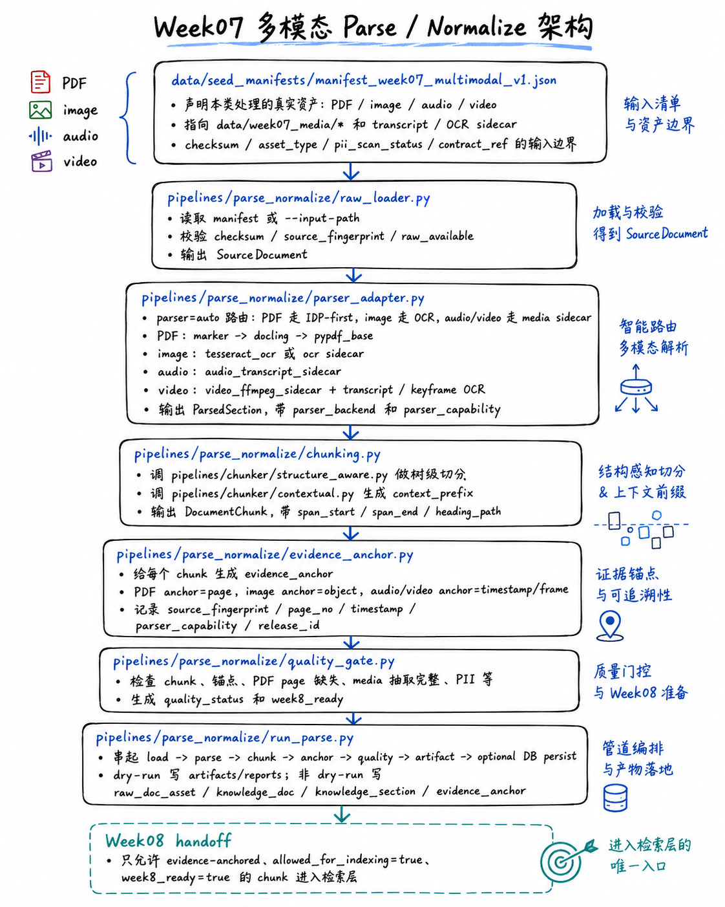

# Week07 Unstructured Data Runbook

Week7：非结构化数据工程，从原始文档到带证据锚点的可检索文档资产。

## Scope

This runbook validates the Student Core path:

1. Validate Week07 JSON contracts.
2. Run parser adapter in deterministic fallback mode or `auto` mode.
3. Generate sections, chunks, evidence anchors, parse run report, quality report, and Week08-ready gate.
4. Load Dagster definitions without breaking Week06/Week08.
5. Hand off only evidence-anchored chunks to Week08.

Week07 does not build embeddings, create vector indexes, call an LLM, or generate citations.

## Code Architecture Map



Read this map before running the commands below. It shows the Week07 file-level path:

- `data/seed_manifests/manifest_week07_multimodal_v1.json` declares the input boundary for PDF, image, audio, and video.
- `pipelines/parse_normalize/raw_loader.py` loads and validates raw assets into `SourceDocument`.
- `pipelines/parse_normalize/parser_adapter.py` routes each modality to the classroom-safe parser path.
- Exact PDF fallback label in artifacts is `pypdf_baseline`.
- `pipelines/parse_normalize/chunking.py` creates structure-aware chunks with span and context fields.
- `pipelines/parse_normalize/evidence_anchor.py` turns chunk provenance into queryable evidence anchors.
- `pipelines/parse_normalize/quality_gate.py` decides whether chunks are safe for Week08 indexing.
- `pipelines/parse_normalize/run_parse.py` ties the pipeline together and optionally persists rows to PostgreSQL.

## PPT Alignment Positioning

The Week07 lesson deck uses the production vocabulary: Marker/Docling IDP, structure-aware chunking, late chunking, contextual retrieval, evidence anchors, quality reports, Whisper/pyannote, VLM/video, and CLIP-style multimodal retrieval. The repository maps those concepts to code paths without making heavy ML dependencies mandatory:

- PDF `auto` is IDP-first: it tries `marker` then `docling`; when those optional packages are unavailable, it emits `pypdf_baseline`.
- `--parser pypdf` remains available only as a teaching baseline, not the recommended production parser.
- Structure-aware chunks carry `span_start`, `span_end`, `heading_path`, and `context_prefix`.
- Evidence anchors carry source identity, page/timestamp/object location, span fields, parser capability, and release lineage.
- Audio/video use real files plus transcript/keyframe sidecars in the classroom path; Whisper/pyannote/VLM/CLIP are optional production adapters.

Reference map: `docs/blueprints/week07/ppt-alignment-roadmap.md`.

## Real Multimodal Boundary

Week07 now has two classroom paths:

- `manifest_workspace_helpcenter_v1.json`: deterministic fallback path for teaching the control plane when raw S3 files are unavailable.
- `manifest_week07_multimodal_v1.json`: real multimodal path for PDF, image OCR, audio transcript, and video keyframe/transcript parsing.

The multimodal path processes real files under `data/week07_media/`:

- `workspace_recovery_manual.pdf`
- `workspace_recovery_evidence.png`
- `support_call_recovery.wav`
- `workspace_recovery_demo.mp4`

Audio and video use transcript sidecars because enterprise ASR is often an upstream service. The raw media file and sidecar are governed together by the manifest, checksum, parser capability, and evidence anchors.

## Start Local Stack

```bash
cp infra/env/.env.example infra/env/.env.local

docker compose --env-file infra/env/.env.local -f infra/docker-compose.yml up -d --build postgres minio minio_init
```

Podman-compatible route:

```bash
podman compose --env-file infra/env/.env.local -f infra/docker-compose.yml up -d --build postgres minio minio_init
```

## Run Contract Tests

```bash
docker compose --profile tools --env-file infra/env/.env.local -f infra/docker-compose.yml run --rm devbox \
  pytest tests/contract/test_week07_parse_contracts.py -v
```

Expected: valid fixtures pass, missing-anchor and PDF-missing-page fixtures fail as intended.

## Run Parse Dry-Run

```bash
docker compose --profile tools --env-file infra/env/.env.local -f infra/docker-compose.yml run --rm devbox \
  python -m pipelines.parse_normalize.run_parse \
  --manifest-path data/seed_manifests/manifest_workspace_helpcenter_v1.json \
  --parser auto \
  --chunk-strategy section_aware_v1 \
  --data-release-id week07-dev-local \
  --dry-run \
  --artifacts-dir artifacts/week07 \
  --report-json reports/week07/parse_run_report.json \
  --quality-report-md reports/week07/chunk_quality_report.md \
  --week8-gate-json reports/week07/week8_ready_gate.json
```

Expected outputs:

- `artifacts/week07/sections.json`
- `artifacts/week07/chunks.json`
- `artifacts/week07/evidence_anchors.json`
- `artifacts/week07/chunk_quality_samples.json`
- `reports/week07/parse_run_report.json`
- `reports/week07/chunk_quality_report.md`
- `reports/week07/week8_ready_gate.json`

The default manifest points to placeholder S3 paths. In a local classroom checkout, this should produce deterministic fallback output and mark `source_path_missing_synthetic_fallback`. This is expected for dry-run teaching.

## Generate / Refresh Real Multimodal Fixtures

The repository ships generated fixtures. If you need to rebuild them after changing the fixture script, run:

```bash
docker compose --profile tools --env-file infra/env/.env.local -f infra/docker-compose.yml run --rm devbox \
  python scripts/week07/generate_multimodal_fixtures.py
```

This creates:

- real PDF bytes with extractable text;
- real PNG bytes for OCR;
- real WAV audio bytes, using `espeak-ng` speech when available and a deterministic classroom WAV fallback otherwise;
- real MP4 video bytes using the Python `imageio-ffmpeg` wheel, without requiring system-level `ffmpeg`;
- transcript/OCR sidecars;
- `data/seed_manifests/manifest_week07_multimodal_v1.json`.

## Run Real PDF / Image / Audio / Video Parse

```bash
docker compose --profile tools --env-file infra/env/.env.local -f infra/docker-compose.yml run --rm devbox \
  python -m pipelines.parse_normalize.run_parse \
  --manifest-path data/seed_manifests/manifest_week07_multimodal_v1.json \
  --parser auto \
  --chunk-strategy section_aware_v1 \
  --data-release-id week07-multimodal-local \
  --dry-run \
  --artifacts-dir artifacts/week07-multimodal \
  --report-json reports/week07/parse_run_report_multimodal.json \
  --quality-report-md reports/week07/chunk_quality_report_multimodal.md \
  --week8-gate-json reports/week07/week8_ready_gate_multimodal.json
```

Expected:

- `status=warn` or `status=success`, depending on whether OCR/parser warnings are emitted;
- `week8_ready=True`;
- `sections.json` includes `asset_type` values `pdf`, `image`, `audio`, and `video`;
- PDF sections use `marker`, `docling`, or `pypdf_baseline`; the baseline is expected on machines without optional IDP packages;
- `evidence_anchors.json` includes PDF `page`, image `object`, and media `timestamp` anchors;
- no chunk is generated from raw binary garbage.

## Run With A Local File

```bash
cat > /tmp/week07-help.html <<'HTML'
<h1>Workspace Recovery</h1>
<p>Admins can restore workspace access by validating identity and replaying recovery steps.</p>
<p>Every recovery answer must cite source evidence and preserve release lineage.</p>
HTML

docker compose --profile tools --env-file infra/env/.env.local -f infra/docker-compose.yml run --rm devbox \
  python -m pipelines.parse_normalize.run_parse \
  --input-path /tmp/week07-help.html \
  --source-id doc:workspace:localdemo01 \
  --content-type html \
  --parser fallback \
  --data-release-id week07-local-file-demo \
  --dry-run \
  --artifacts-dir artifacts/week07-local-file \
  --report-json reports/week07/parse_run_report_local_file.json \
  --quality-report-md reports/week07/chunk_quality_report_local_file.md \
  --week8-gate-json reports/week07/week8_ready_gate_local_file.json
```

Expected: fallback parser is still marked, but because the raw file is real, `week8_ready` can be true when anchors and metadata are complete.

## Run Integration Tests

```bash
docker compose --profile tools --env-file infra/env/.env.local -f infra/docker-compose.yml run --rm devbox \
  pytest \
  tests/integration/test_week07_parse_pipeline.py \
  tests/integration/test_week07_quality_gate.py \
  tests/integration/test_week07_multimodal_pipeline.py \
  tests/integration/test_week07_ppt_alignment.py \
  -v
```

## Validate Dagster Definitions

```bash
docker compose --profile tools --env-file infra/env/.env.local -f infra/docker-compose.yml run --rm devbox \
  python -c "from pipelines.definitions import defs; print(defs)"
```

Expected: definitions load with ingestion, parse/normalize, lakehouse, Week06 data factory, and Week08 indexing assets registered.

## Week1-Week6 Regression Checks

```bash
docker compose --profile tools --env-file infra/env/.env.local -f infra/docker-compose.yml run --rm devbox \
  pytest tests/contract/ -v

docker compose --profile tools --env-file infra/env/.env.local -f infra/docker-compose.yml run --rm devbox \
  pytest tests/integration/test_week06_definitions_loadable.py -v
```

## Troubleshooting

| Symptom | Likely cause | Action |
|---|---|---|
| `source_path_missing_synthetic_fallback` | Manifest references S3 placeholder objects | Use dry-run for class, or provide local files with `--input-path`. |
| `source_fingerprint mismatch` | `--expected-fingerprint` does not match raw bytes | Recompute the fingerprint or point to the correct file. |
| `missing_evidence_anchor` | Chunk generation ran without anchor generation | Use `run_parse.py`; do not call chunking alone for Week08 handoff. |
| `week8_ready=false` | Synthetic fallback or blocking quality error | Fix raw source availability or quality gate error before indexing. |
| PDF backend is `pypdf_baseline` | Marker/Docling optional packages are not installed in devbox | This is expected in classroom Docker/Podman runs; install production parser packages only for instructor-scale IDP demos. |
| `audio_transcript_sidecar_missing` | Audio file exists but no ASR transcript sidecar is available | Provide `.transcript.jsonl` or run an upstream ASR job before indexing. |
| `image_ocr_text_empty` | Image exists but OCR produced no text | Improve OCR preprocessing or provide audited OCR sidecar. |
| `video_no_transcript_or_keyframe_ocr` | Video has no transcript and no keyframe OCR | Provide transcript/keyframe sidecars or rerun video preprocessing. |
| Dagster import error | Devbox image is stale after dependency changes | Rebuild devbox with Docker or Podman compose. |

## Handoff To Week08

Week08 can consume:

- `artifacts/week07/chunks.json`
- `artifacts/week07/evidence_anchors.json`
- `reports/week07/week8_ready_gate.json`
- `document_chunk` rows mapped to `knowledge_section`
- `evidence_anchor` rows or artifacts
- `chunk_strategy_version`
- `parse_strategy_version`
- `source_fingerprint`
- `doc_version`
- `quality_status`

Week08 cannot assume:

- Chunks without anchors are indexable.
- LLM-generated citations are valid.
- `allowed_for_indexing=false` data can be indexed.
- Fallback parser output has full Docling coordinates.
- Parse/chunk strategy version can be ignored.
